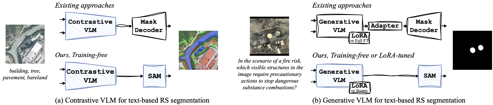

<div align="center">

<h1>🗺️ Enabling Training-Free Text-Based Remote Sensing Segmentation</h1>

<h3> <a href="https://www.grss-ieee.org/events/earthvision-2026/" target="_blank">EARTHVISION @ CVPR 2026</a> 
    and <a href="https://cvprinparis.github.io/CVPR2026InParis/" target="_blank">CVPR@Paris</a> 
</h3>

<div>
    <strong>Training-free OVSS and LoRA-tuned referring and reasoning segmentation</strong>
</div>

<div>
    <a href='https://scholar.google.com/citations?user=R6rtktIAAAAJ&hl=en' target='_blank'>Jose Sosa</a>&emsp;
    <a href='https://scholar.google.com/citations?user=Osx2uh5eA2kC&hl=en' target='_blank'>Danila Rukhovich</a>&emsp;
    <a href='https://scholar.google.com/citations?user=K3EWusMAAAAJ&hl=en' target='_blank'>Anis Kacem</a>&emsp;
    <a href='https://scholar.google.com/citations?user=WBmJVSkAAAAJ&hl=en' target='_blank'>Djamila Aouada</a>&emsp;
</div>
<div>
    The Interdisciplinary Centre for Security, Reliability and Trust (SnT), Univerity of Luxembourg&emsp;
</div>

<div>
    <h4 align="center">
        • <a href="https://arxiv.org/abs/2602.17799" target='_blank'>[arXiv]</a> •
    </h4>
</div>


Existing methods rely on additional trainable mask decoders and adapters. We propose a training-free methodology
that combines VLMs and SAM without introducing new trainable components. Additionally, with LoRA fine-tuning, our method achieves state-of-the-art performance on reasoning segmentation. Blue is for frozen components.

</div>

## Abstract
> *Recent advances in Vision Language Models (VLMs) and Vision Foundation Models (VFMs) have opened new opportunities for zero-shot text-guided segmentation of remote sensing imagery. However, most existing approaches still rely on additional trainable components, limiting their generalisation and practical applicability. In this work, we investigate to what extent text-based remote sensing segmentation can be achieved without additional training, by relying solely on existing foundation models. We propose a simple yet effective approach that integrates contrastive and generative VLMs with the Segment Anything Model (SAM), enabling a fully training-free or lightweight LoRA-tuned pipeline. Our contrastive approach employs CLIP as mask selector for SAM’s grid-based proposals, achieving state-of-the-art open-vocabulary semantic segmentation (OVSS) in a completely zero-shot setting. In parallel, our generative approach enables reasoning and referring segmentation by generating click prompts for SAM using GPT-5 in a zero-shot setting and a LoRA-tuned Qwen-VL model, with the latter yielding the best results. Extensive experiments across 19 remote sensing benchmarks, including open-vocabulary, referring, and reasoning-based tasks, demonstrate the strong capabilities of our approach.*

## Code
Coming soon...

## Citation

```
@article{sosa2026enabling,
  title={Enabling Training-Free Text-Based Remote Sensing Segmentation},
  author={Sosa, Jose and Rukhovich, Danila and Kacem, Anis and Aouada, Djamila},
  journal={arXiv preprint arXiv:2602.17799},
  year={2026}
}
```
